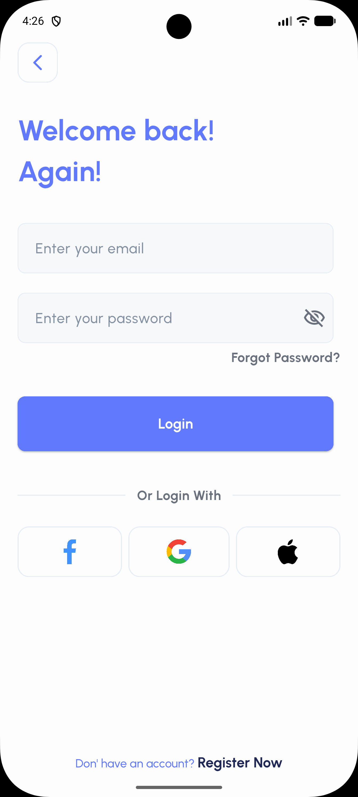

# E-Wallet & Finance App 💳

A modern, responsive, and feature-rich digital wallet application designed to help users manage their personal finances, track expenses, and perform daily transactions with ease. 

## 📱 App Preview

<p align="center">
  
  
</p>

## ✨ Key Features

### 🔐 Authentication & Onboarding
* **Welcome Screen:** Engaging introductory screen.
* **Secure Login & Registration:** Standard email/password authentication.
* **Social Login:** Quick access using Google, Apple, or Facebook.
* **Complete Password Recovery Flow:** Includes "Forgot Password", OTP Verification, and "Create New Password" screens.

### 🏠 Dashboard & Core Actions
* **Home Screen Overview:** Displays user greeting and primary card balances (e.g., in Egyptian Pounds - EG).
* **Quick Actions:** Easy access buttons to **Send Money**, **Pay Bills**, **Request Funds**, and view **Contacts**.
* **Bottom Navigation:** Seamless routing between Home, Cards, Activity/Statistics, and Profile.

### 💳 Card Management
* **My Cards:** A dedicated section to view all linked physical and virtual cards (e.g., Visa).
* **Card Details:** Safely displays masked card numbers and individual card balances.

### 📊 Statistics & Tracking
* **Financial Insights:** Interactive bar charts detailing financial activity over selected periods.
* **Income vs. Outcome:** Clear visual breakdown of money received versus money spent.

### 👤 User Profile
* **Profile Management:** View and edit personal information including Full Name, Email, Phone Number, and Address.

## 🛠️ Tech Stack
* **Framework:** [Flutter](https://flutter.dev/)
* **Language:** [Dart](https://dart.dev/)
* **State Management:** *(Add your state management tool here, e.g., Provider, Bloc, Riverpod)*
* **Design:** Clean and modular UI components ensuring a smooth user experience across iOS and Android.

## 🚀 Getting Started

Follow these steps to run the project locally on your machine.

### Prerequisites
* Flutter SDK installed on your machine.
* An IDE such as Android Studio or VS Code.

### Installation

1. **Clone the repository:**
   ```bash
   git clone [https://github.com/ziad_yaseen/finance_ui.git](https://github.com/ziad-yaseen/finance-ui.git)